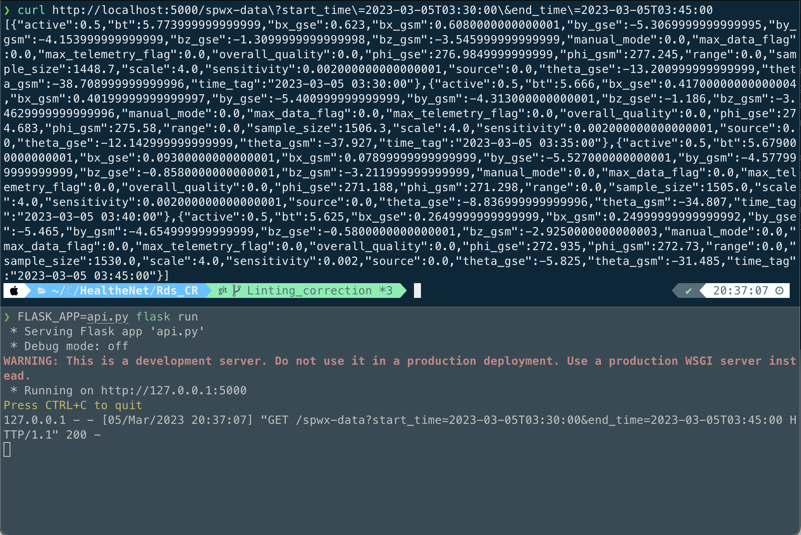

# Task 3
Create a single RESTful endpoint in Flask for delivering spwx data:
Download https://services.swpc.noaa.gov/json/rtsw/rtsw_mag_1m.json at runtime to form a SQLite3 table.
Have the endpoint use query strings to allow you to select a time period of up to an hour. Where the data is grouped into periods of 5 minute averages and returned via json.

Requires:

- Python 3.9+

## Setup:

```bash
python3 -m venv venv
source venv/bin/activate
pip install --upgrade pip
pip install -r requirements.txt
```

## Running API Locally
Execute the following command
```bash
FLASK_APP=api.py flask run
```

The API will run on the default port of 5000.
Pass in query strings for the required time period, i.e

- http://localhost:5000/spwx-data?start_time=2023-03-05T03:30:00&end_time=2023-03-05T04:30:00

**Note:** The API will only return data if your time period is 
- Within the last 24 hours
- The range is no greater than 1 hour

## Expected Outputs
